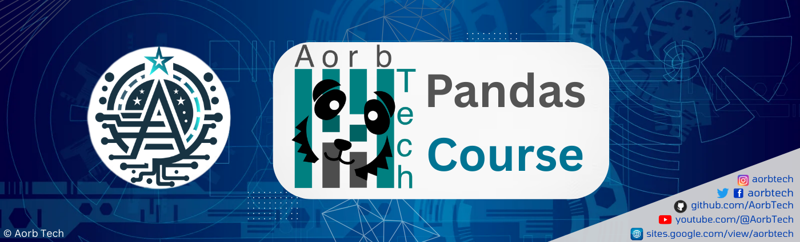

## 01. Introduction to Pandas
1.1 Introduction to Pandas 
1.2 Founder of Pandas  
1.3 Why we use Pandas  
1.4 How to Install and use Pandas  
1.5 Prerequisite to Learn Pandas  
1.6 Outline of this Course  

## 02. Series
2.1 Creating a Series
2.2 Updating a Series
2.3 Accessing a Series
2.4 Series Operations

## 04. CSV Files
4.1 Reading a CSV File
4.2 Editing a CSV File
4.3 Properties
4.4 Parameters and Functions
